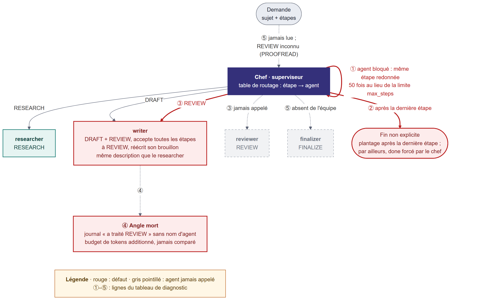
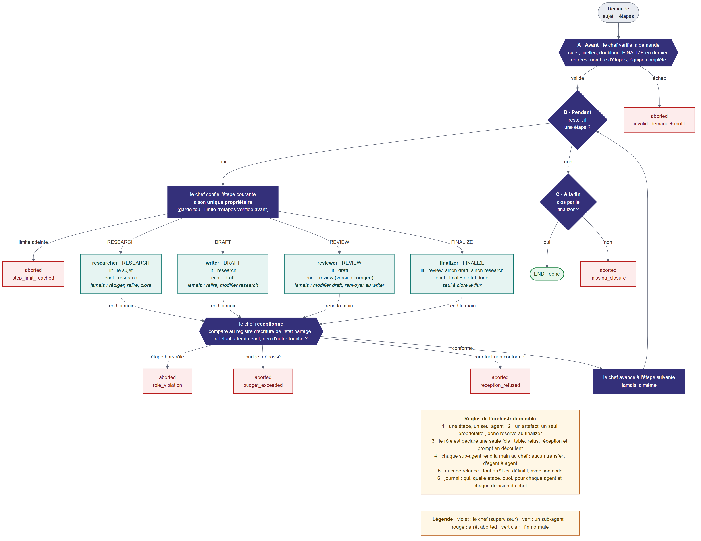
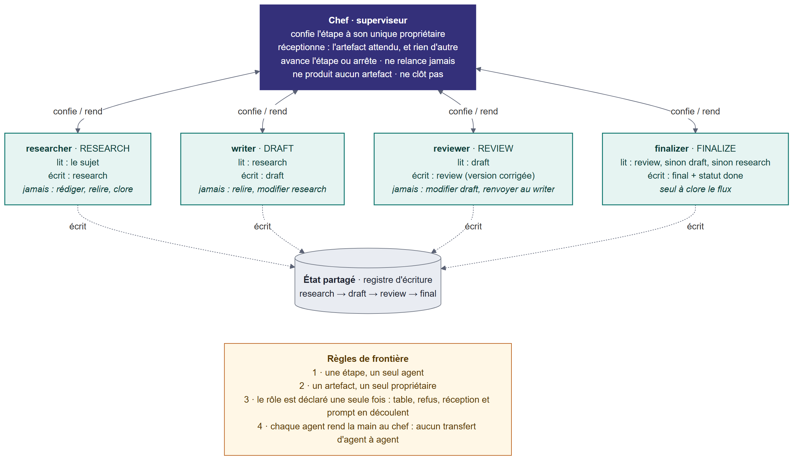
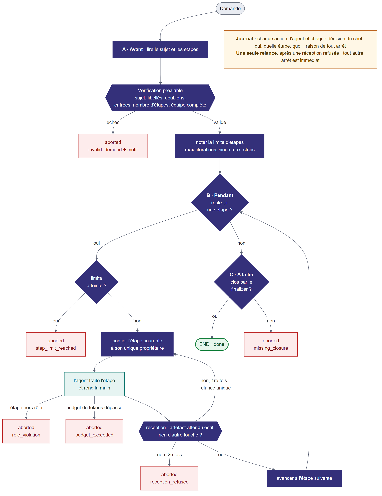

# Livrable de conception · Note de diagnostic et schéma cible de l'orchestration

Brief Kaldera « L'équipe d'agents qui se marche dessus » · Phase CONCEPTION · 29/09/2026
Code étudié : dépôt `kaldera-team-ko`, commit `37c2cb3`

---

## En bref

- Kaldera est un superviseur : un chef confie chaque étape à un sub-agent, qui lui rend la main. Ce
  schéma a un chemin de retour vers le chef, donc il exige un frein.
- Les freins sont écrits dans la spécification mais pas appliqués dans le code. Le chef confie la
  relecture au mauvais agent, et le journal ne permet pas de le voir.
- Le chef ne produit rien. Il confie chaque étape à son unique propriétaire, vérifie ce qu'on lui
  rend, puis avance ou arrête, sans jamais relancer. Le flux vérifie la demande avant de démarrer,
  suit l'ordre de la demande, et seul le finalizer clôt.
- Des tests provoquent chaque boucle et chaque conflit. Une grille de preuve montre que chaque
  défaut est attrapé par au moins un test.

---

## Les agents de l'app

`RESEARCH`, `DRAFT`, `REVIEW`, `FINALIZE` sont des étapes (`Step`, `steps.py:7-11`), pas des agents.
Voici les agents qui exécutent ces étapes, tels qu'ils existent dans le code actuel (avant
correction) :

| Agent        | Fichier                   | Étape(s) gérée(s) (`handles`) | Artefact écrit    | Lit             |
| ------------ | -------------------------- | ------------------------------ | ------------------ | ---------------- |
| `Researcher` | `agents/researcher.py`     | `RESEARCH`                     | `artifacts.research` | `state.topic`   |
| `Writer`     | `agents/writer.py`         | `DRAFT`, `REVIEW`               | `artifacts.draft`  | `artifacts.research` |
| `Reviewer`   | `agents/reviewer.py`       | `REVIEW`                        | `artifacts.review` | `artifacts.draft`    |
| `Finalizer`  | `agents/finalizer.py`      | `FINALIZE`                      | `artifacts.final`, `status = done` | `artifacts.review`  |

Le chef n'est pas un agent au sens du code : c'est le routage (`STEP_TO_AGENT`,
`orchestrator.py:16-21`), qui délègue à l'un des quatre agents ci-dessus selon l'étape en cours.

C'est là que se loge le conflit ③ : `STEP_TO_AGENT[REVIEW]` pointe vers `"writer"`, pas
`"reviewer"`. Le `Writer` accepte `REVIEW` (son `accepts()` renvoie toujours vrai), écrit dans
`artifacts.draft` au lieu de `artifacts.review`, et porte la même description que le `Researcher`
(copiée). Le `Reviewer` existe, gère bien `REVIEW`, mais n'est jamais appelé : il est instancié
dans `AGENTS` mais absent du routage. Le `Finalizer` a le problème inverse : routé par nom
(`"finalizer"`), mais absent de `AGENTS`/`AGENTS_BY_NAME`.

---

## 1. Diagnostic : où ça boucle, où ça entre en conflit, et pourquoi

Lecture complète du dépôt, puis exécution des tests : 14 échecs sur 14. Les défauts se masquent les
uns les autres, parce que le premier plantage cache les suivants. Une sonde les a donc levés un par
un, en mémoire, sans modifier le dépôt. Le résultat le plus parlant : une fois les plantages levés,
le scénario principal finit en `done`, dans le budget, sans qu'aucune relecture ait eu lieu.

| N° | Endroit                  | Ce qui se passe                                                                                                                                          | Cause dans le code                                                                                                                                   | Preuve                                                                                                                                                                                          |
| -- | ------------------------ | -------------------------------------------------------------------------------------------------------------------------------------------------------- | ---------------------------------------------------------------------------------------------------------------------------------------------------- | ----------------------------------------------------------------------------------------------------------------------------------------------------------------------------------------------- |
| ①  | **Boucle** (latente)     | un agent qui n'avance pas est rappelé 50 fois au lieu de `max_steps` ; ne se déclenche pas sur les scénarios fournis, seulement avec un agent défaillant | la limite est calculée mais jamais lue, et le chef ne vérifie pas que l'étape avance (`runner.py:26-39`)                                             | `test_step_budget_is_enforced` : 50 étapes pour 4 au plus attendues                                                                                                                             |
| ②  | **Fin du flux**          | le chef plante après la dernière étape ; par ailleurs, il passe lui-même le statut à `done`                                                              | `>` au lieu de `>=` (`orchestrator.py:25`), `done` forcé (`runner.py:33-35`)                                                                         | `test_route_returns_end_once_all_steps_done`                                                                                                                                                    |
| ③  | **Conflit sur `REVIEW`** | le writer occupe le poste du reviewer et réécrit son brouillon ; la relecture n'a jamais lieu ; sa description est celle du researcher                   | table (`orchestrator.py:19`), `handles` du writer (`writer.py:12`), `accepts` toujours vrai (`writer.py:14-15`), description copiée (`writer.py:11`) | `test_each_step_handled_by_exactly_one_agent`, `test_review_is_routed_to_reviewer`, `test_writer_refuses_foreign_step`, `test_agent_descriptions_are_distinct`, sonde : aucun artefact `review` |
| ④  | **Angle mort**           | le journal ne dit pas qui a fait quoi ; le budget de tokens n'arrête personne                                                                            | nom de l'agent non enregistré (`logging_utils.py:10-13`), budget jamais comparé (`agents/base.py:39-40`)                                             | `test_log_entry_carries_agent_id`, `test_per_agent_token_budget_is_enforced`                                                                                                                    |
| ⑤  | **Défauts masquants**    | la demande n'est pas lue, `REVIEW` est inconnu, le finalizer n'est pas dans l'équipe : ces plantages cachent les autres défauts                          | `runner.py:12-13`, `PROOFREAD` au lieu de `REVIEW` (`steps.py:19`), `orchestrator.py:13`                                                             | `test_load_context_populates_state`, tests de `test_steps.py`, `test_finalizer_is_registered`                                                                                                   |

Pourquoi, au fond :

1. Les freins existent à moitié. La limite est calculée mais pas lue, le budget est additionné mais
   pas comparé, le refus hors du rôle existe mais le writer le contourne, le nom de l'agent est reçu
   mais pas noté.
2. Le rôle d'un agent est déclaré à trois endroits du code (la table, `handles` et `accepts`), sans
   rien qui vérifie qu'ils concordent. Pour `REVIEW`, ils se contredisent.
3. Le chef délègue sans réceptionner. Il ne vérifie ni que l'étape a avancé, ni ce qui a été produit,
   ni qui l'a produit.

Les symptômes du brief, rattachés au code :

| Symptôme du brief                         | Endroit                                                                         |
| ----------------------------------------- | ------------------------------------------------------------------------------- |
| Deux sub-agents se renvoient la balle     | ③ : responsabilité floue sur `REVIEW` entre writer et reviewer (voir section 6) |
| L'orchestration boucle                    | ① et ②                                                                          |
| Un sub-agent fait le travail d'un autre   | ③                                                                               |
| Le flux ne respecte plus la spécification | ②, ③ et ⑤                                                                       |

---

## Schéma cible de l'orchestration (rôles + flux)

Ce schéma réunit en une seule vue ce que les sections 2 et 3 détaillent séparément :

- **le flux** : le déroulé en trois temps (A avant, B pendant, C à la fin), qui sert d'ossature ;
- **les rôles** : l'étape « confier » se ramifie vers les quatre fiches de poste, et chaque
  sub-agent rend la main au chef pour la réception ;
- **les arrêts** : chaque case rouge est un arrêt définitif, avec son code.

Le seul retour du flux mène à l'étape **suivante**. Aucun chemin ne ramène une étape à un agent qui
l'a déjà eue : c'est ce qui ferme la boucle du point ①.

---

## 2. Détail · les rôles

- Une fiche de poste par agent : une étape, ce qu'il lit, l'artefact dont il est le seul
  propriétaire, et ce qu'il ne fait jamais.
- Le chef ne produit rien. Il confie l'étape, réceptionne (l'artefact attendu est écrit, et rien
  d'autre), puis avance l'étape. C'est lui, et non plus l'agent, qui fait avancer.
- Quatre règles de frontière (les trois règles de la note du point 2, plus l'absence de transfert) :
  une étape, un seul agent ; un artefact, un seul propriétaire ; un rôle déclaré une seule fois, dont
  se déduisent la table, le refus, la réception et le prompt ; aucun transfert d'agent à agent.
- Le reviewer produit la version corrigée. La spécification parle de « relecture et corrections »,
  et le flux ne revient jamais au writer. La description actuelle du reviewer
  (« signale les corrections ») est donc à corriger.

---

## 3. Détail · le flux

Le flux se déroule en trois temps :

- **A · Avant** : le chef lit la demande et la vérifie. Il contrôle le sujet, les libellés, l'absence
  de doublon, `FINALIZE` en dernier, les entrées de chaque étape, le nombre d'étapes et la
  composition de l'équipe. Une demande invalide ne démarre pas.
- **B · Pendant** : une étape à la fois, dans l'ordre exact de la demande. Le budget d'étapes et le
  budget de tokens sont appliqués. Chaque action et chaque décision du chef est journalisée.
- **C · À la fin** : seul le finalizer passe le statut à `done`, puis le chef répond `END`.

Le seul retour du flux mène à l'étape **suivante**, jamais à la même. Tout franchissement de
frontière arrête le flux en `aborted`, avec un code, et sans relance :

| Code                       | Situation                                                     |
| -------------------------- | ------------------------------------------------------------- |
| `invalid_demand` (+ motif) | la demande échoue à une vérification préalable                |
| `role_violation`           | un agent reçoit une étape hors de son rôle                    |
| `budget_exceeded`          | un agent dépasse son budget de tokens                         |
| `reception_refused`        | l'artefact attendu manque, ou un autre artefact a été écrit   |
| `step_limit_reached`       | la limite d'étapes est atteinte (garde-fou)                   |
| `missing_closure`          | la fin est atteinte sans clôture par le finalizer (garde-fou) |

Parcours attendus sur les scénarios fournis :

- `happy_path` : researcher → writer → reviewer → finalizer. 4 étapes, `done`, `final` construit sur
  `review`.
- `research_only` : researcher → finalizer. 2 étapes, `done`, `final` construit sur `research`.

---

## 4. Détecter une boucle ou un conflit par un test

Un bon test provoque la situation, l'observe dans les traces, et échoue pour la bonne raison. Les
tests sont rangés sur quatre niveaux :

| Niveau                 | Ce qu'on vérifie                                                                                                                                                                | Test clé                                         |
| ---------------------- | ------------------------------------------------------------------------------------------------------------------------------------------------------------------------------- | ------------------------------------------------ |
| 1 · Dessin de l'équipe | chaque étape a un seul propriétaire, et chaque agent refuse les étapes des autres (12 refus, 4 acceptations)                                                                    | `test_every_agent_refuses_every_foreign_step`    |
| 2 · Boucles et arrêts  | un agent bloqué est arrêté à la première réception ; chaque demande invalide est refusée avec son motif                                                                         | `test_stuck_agent_is_stopped_at_first_reception` |
| 3 · Conflits           | chaque étape est traitée par son propriétaire ; un intrus est rejeté ; un refus ne renvoie pas la balle à un autre agent                                                        | `test_each_step_is_done_by_its_owner`            |
| 4 · Invariants         | après chaque exécution : aucune étape confiée deux fois, aucune action sans délégation, chaque artefact écrit par son seul propriétaire, limite respectée, fin toujours motivée | vérification commune, appliquée à chaque test    |

- Tous les tests supposent que le journal porte le nom de l'agent, y compris pour le chef. Trois
  traces s'y ajoutent :
  - un registre d'écriture des artefacts ;
  - la clôture attribuée au finalizer dans le journal du chef, dont dépend l'invariant sur `done` ;
  - la limite d'étapes notée au départ.

  Le registre est nécessaire parce que le writer réécrit `draft` avec la même valeur : comparer les
  artefacts avant et après ne montrerait rien.
- Les invariants ne portent que sur le travail accepté. Un artefact refusé à la réception, ou laissé
  par un dépassement de budget, est conservé mais marqué incomplet, donc exclu. Le test qui provoque
  la violation vérifie qu'elle a été arrêtée avec le bon code.
- Trois faiblesses des tests fournis, et leur réponse :
  - `test_step_budget_is_enforced` passerait pour une mauvaise raison. Sa demande `[RESEARCH]` ne
    finit pas par `FINALIZE`, donc la vérification préalable la refuserait avant que le budget soit
    éprouvé. On le garde tel quel, et `test_stuck_agent_is_stopped_at_first_reception` vise la
    bonne raison.
  - Le garde-fou de la limite ne se déclenche plus en fonctionnement normal, puisqu'une demande trop
    longue est refusée au départ et qu'aucune étape n'est relancée.
    `test_step_guard_stops_at_limit` l'éprouve avec un état fourni déjà à la limite.
  - Le test de bout en bout juge le flux sur la limite que le flux s'est lui-même donnée. On y ajoute
    un oracle indépendant de `max_steps` : le nombre exact d'étapes, l'ordre des agents, et
    l'artefact sur lequel `final` est construit.
- Une fois le code corrigé, on réintroduit chaque défaut, un à la fois. Un test précis doit alors
  échouer sur sa propre vérification. La grille couvre les 12 défauts relevés et la relance sans
  fin ; elle est détaillée dans la note du point 4, section 7.
- Les tests et les scénarios fournis restent intacts, pour garantir la non-régression. Les tests
  nouveaux sont ajoutés à côté.

---

## 5. Décisions prises, à valider

| N° | Décision                                                                                                                  | Origine                                     |
| -- | ------------------------------------------------------------------------------------------------------------------------- | ------------------------------------------- |
| D1 | Le reviewer produit la version corrigée, sans renvoyer au writer                                                          | spécification, l. 12                        |
| D2 | L'avancement de l'étape passe de l'agent au chef, après réception                                                         | choix de conception                         |
| D3 | Toute frontière franchie arrête le flux (`aborted` + code), sans relance ni autre agent                                   | choix de conception                         |
| D4 | La demande et la composition de l'équipe sont vérifiées avant tout travail, même pour un état fourni directement          | spécification, l. 27 et 29, étendue         |
| D5 | Une demande doit se terminer par `FINALIZE` (écarte la demande `[RESEARCH]` d'un test fourni)                             | choix de conception                         |
| D6 | `max_steps` est lu dans `expected` des scénarios, et `max_iterations` prime                                               | écart avec la spécification, l. 29, signalé |
| D7 | `final` est construit sur l'artefact le plus abouti : `review`, sinon `draft`, sinon `research`                           | choix de conception                         |
| D8 | Raisons d'arrêt sous forme de codes stables, conservées dans l'état ; le chef journalise ses décisions                    | spécification, l. 35-36, étendue            |
| D9 | Tests et scénarios fournis intacts ; tests nouveaux à côté ; grille de preuve obligatoire avant de clore le Développement | choix de conception                         |

---

## 6. Ce qui reste incertain

- « Se renvoient la balle » : aucun aller-retour d'agent à agent n'existe dans le code. Nous lisons
  l'expression au sens de l'idiome, se rejeter une responsabilité — c'est le flou sur `REVIEW`.
  Cette lecture reste à confirmer avec le formateur. Les invariants du niveau 4 détecteraient un
  vrai ping-pong s'il apparaissait.
- Le chemin « live » (`graph.py`) est une coquille vide. S'il est câblé, il devra réutiliser le même
  chef.
- Aucun vrai LLM n'a été testé.

---

## Pour aller plus loin

- Notes détaillées, point par point, dans `doc/` : `conception_point_1_boucles_et_conflits.md`,
  `conception_point_2_roles_et_frontieres.md`, `conception_point_3_conformite_specification.md`,
  `conception_point_4_detection_par_les_tests.md`.
- Schémas : les quatre images (`01_diagnostic_etat_actuel.png`, `02_cible_roles.png`,
  `03_cible_flux.png`, `cible_roles_et_flux.png`) dans `schemas/`. Leur source Mermaid est dans
  `note_orale_presentation.md` (les trois premières, affichables directement sur GitHub) ; le
  `.png` s'y régénère avec `@mermaid-js/mermaid-cli` :
  `mmdc -i <nom>.mmd -o <nom>.png -b white -s 2 -w 1600`.
