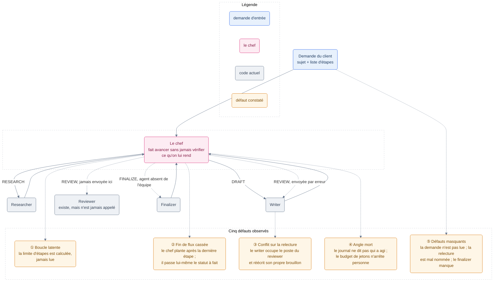
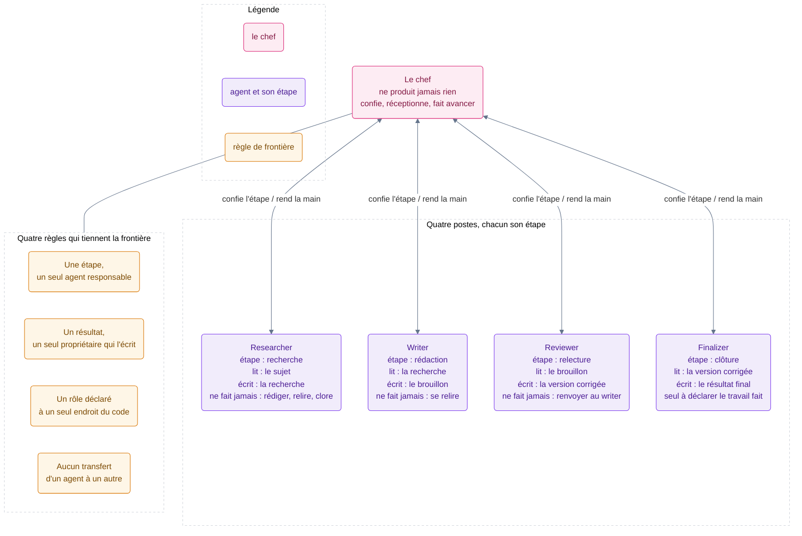
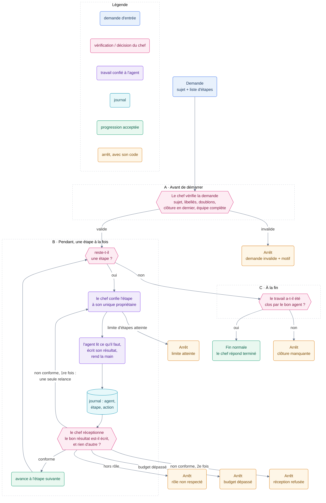

# Présentation orale · Diagnostic Kaldera

Kaldera est un orchestrateur multi-agents : un chef confie chaque étape d'une tâche à un agent
spécialisé, qui la traite et rend la main au chef. La tâche se découpe en quatre étapes :
`RESEARCH` (rechercher), `DRAFT` (rédiger), `REVIEW` (relire/corriger), `FINALIZE` (clore). Quatre
agents leur correspondent : `Researcher`, `Writer`, `Reviewer`, `Finalizer`.

Le bug central : quand l'étape `REVIEW` arrive, le chef l'envoie au `Writer`, pas au `Reviewer`. Le
`Writer` accepte n'importe quelle étape, se relit lui-même, et le `Reviewer` n'est jamais appelé.
Le flux se termine `done` sans qu'aucune relecture ait eu lieu, et rien ne le signale.

En une phrase : le chef délègue mais ne vérifie jamais ce qu'on lui rend. La suite montre où ça se
voit dans le code, comment ça a été détecté, et comment ça se corrige.

Méthode de détection : lecture complète du dépôt, puis exécution des tests fournis, avec 14 échecs
sur 14. Les défauts se cachaient les uns les autres : le premier plantage empêchait de voir les
suivants. Il a fallu les lever un par un, en mémoire, sans toucher au dépôt, pour voir la suite.
Une fois tout levé, le scénario principal se terminait `done`, dans le budget, sans qu'aucune
relecture n'ait eu lieu. C'est ce résultat qui a mis le doigt sur le vrai problème.

---

## 1. L'état actuel

Trois points portent l'essentiel du diagnostic :

1. La boucle possible sur l'étape en cours : rien ne compte le nombre de fois où un agent est
   rappelé. La limite (`max_steps`) est calculée dans `runner.py` mais jamais lue.
2. Le routage cassé sur `REVIEW` : la table `STEP_TO_AGENT`, dans `orchestrator.py`, associe
   `REVIEW` à `"writer"` au lieu de `"reviewer"`. Le `Reviewer` existe, gère bien `REVIEW`, mais
   n'est jamais routé vers.
3. L'absence de contrôle du chef : il fait avancer l'étape sans vérifier quel artefact a été écrit,
   ni par quel agent.

Un niveau plus bas : le rôle d'un agent est déclaré à trois endroits différents dans le code : la
table de routage (`orchestrator.py`), la liste des étapes qu'il gère et sa propre fonction
d'acceptation (`writer.py`). Rien ne vérifie que ces trois déclarations concordent. Pour `REVIEW`,
elles se contredisent, et c'est cette contradiction qui casse le flux. Le code a écrit les
garde-fous, mais ne les applique jamais.

Trois causes racines expliquent les cinq défauts, pas cinq causes indépendantes. Premièrement, les
garde-fous existent à moitié : la limite d'étapes est calculée mais pas lue, le budget de jetons est
additionné mais jamais comparé, le refus hors rôle existe mais le `Writer` le contourne.
Deuxièmement, le rôle de chaque agent est déclaré trois fois sans qu'aucune vérification ne les
recoupe. Troisièmement, le chef délègue sans réceptionner : il ne vérifie ni que l'étape a avancé,
ni ce qui a été produit, ni qui l'a produit. Corriger ces trois causes suffit à corriger les cinq
défauts : ce n'est pas cinq correctifs séparés à écrire.

Ce diagnostic recoupe exactement les symptômes du brief de départ : deux sub-agents qui semblent se
renvoyer la balle, c'est le conflit sur `REVIEW` ; l'orchestration qui boucle, c'est la limite non
lue et la fin de flux cassée ; un sub-agent qui fait le travail d'un autre, c'est encore `REVIEW` ;
le flux qui ne respecte plus la spécification, c'est la combinaison des trois.

---

## 2. Les rôles cibles

Quatre règles ferment les frontières entre agents : une étape n'a qu'un seul agent responsable ; un
résultat n'a qu'un seul propriétaire qui a le droit de l'écrire ; un agent refuse toute étape qui
n'est pas la sienne, sans exception ; le chef ne produit rien, il confie l'étape, réceptionne le
résultat attendu, et fait avancer.

Le `Reviewer` produit lui-même la version corrigée (`reviewer.py`). Le flux ne revient jamais au
`Writer` après relecture : la spécification demande une relecture *et* des corrections, pas un
simple signalement.

---

## 3. Le flux cible

Le flux se déroule en trois temps. Avant de démarrer, le chef vérifie la demande (étapes valides,
pas de doublon, entrées présentes) ; une demande invalide ne démarre pas. Pendant, une étape à la
fois, dans l'ordre demandé, avec un budget de jetons par agent. À la fin, seul le `Finalizer` fait
passer le statut à `done`.

La règle qui ferme la boucle observée dans l'état actuel : une étape qui échoue ne revient jamais
vers le même agent. Soit le flux avance, soit il s'arrête en `aborted` avec un code précis
(`role_violation`, `budget_exceeded`, `reception_refused`, `step_limit_reached`,
`missing_closure`).

---

## 4. Un parcours complet

La demande contient quatre étapes : `RESEARCH`, `DRAFT`, `REVIEW`, `FINALIZE`.

1. Le chef vérifie la demande : quatre étapes valides, pas de doublon, entrées présentes. Elle
   passe.
2. `RESEARCH` part vers le `Researcher`, qui écrit l'artefact `research`. Le chef réceptionne, fait
   avancer.
3. `DRAFT` part vers le `Writer`, qui lit `research` et écrit `draft`. Le chef réceptionne, fait
   avancer.
4. `REVIEW` part vers le `Reviewer`, pas vers le `Writer`. Il lit `draft`, écrit `review`. Le chef
   réceptionne, fait avancer.
5. `FINALIZE` part vers le `Finalizer`, qui construit `final` à partir de `review` (`finalizer.py`),
   et passe le statut à `done`. Le chef répond `END`.

À aucun moment un agent ne reçoit deux fois la même étape (la seule exception serait une relance
unique après un résultat non conforme, qui n'arrive pas dans ce scénario), et à aucun moment un artefact n'est écrit
par quelqu'un d'autre que son propriétaire. C'est ce parcours exact que les tests reproduisent pour
vérifier que la correction tient.

Un second scénario existe, plus court : `RESEARCH` puis `FINALIZE`, sans rédaction ni relecture.
Le `Researcher` écrit `research`, puis le `Finalizer` clôt directement à partir de cet artefact,
faute de version rédigée ou corrigée. Ce cas confirme que le finalizer ne dépend pas d'un chemin
figé à quatre étapes : il construit son résultat sur l'artefact de contenu le plus abouti
disponible, la version corrigée, sinon le brouillon, sinon la recherche brute.

---

## 5. Comment la correction se prouve

Un test qui prouve une correction doit remplir trois conditions : provoquer la situation qu'il
vise, au lieu d'attendre qu'elle survienne ; l'observer dans une trace exploitable, comme le
journal des agents ou le registre d'écriture des artefacts ; et échouer précisément pour la raison
qu'il cible, pas pour une erreur annexe.

Le protocole retenu réintroduit chaque défaut un par un, une fois le code corrigé. À chaque
réintroduction, au moins un test doit échouer sur sa propre vérification, avec un message qui nomme
le défaut. Le défaut retiré, tout doit repasser. Un défaut qu'aucun test n'attrape est un trou de la
suite, à combler avant de conclure. Cette grille couvre les douze défauts relevés sur les trois
points du diagnostic, plus le risque de relance sans fin.

---

## Annexe · Fichiers sources

Code étudié : dépôt `kaldera-team-ko`, commit `37c2cb3`. Fichiers cités dans cette présentation :

- `src/kaldera/steps.py` — étapes métier (`Step`) et résolution des libellés de scénario
- `src/kaldera/orchestrator.py` — table de routage `STEP_TO_AGENT` et fonction `route`
- `src/kaldera/runner.py` — boucle d'exécution, limite d'étapes (`HARD_CAP`)
- `src/kaldera/agents/base.py` — classe de base `Agent`, `accepts`, `run`
- `src/kaldera/agents/researcher.py` — agent `Researcher`
- `src/kaldera/agents/writer.py` — agent `Writer`
- `src/kaldera/agents/reviewer.py` — agent `Reviewer`
- `src/kaldera/agents/finalizer.py` — agent `Finalizer`
